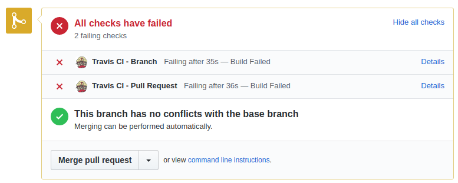
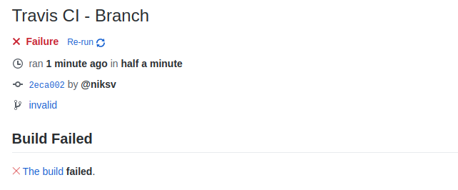
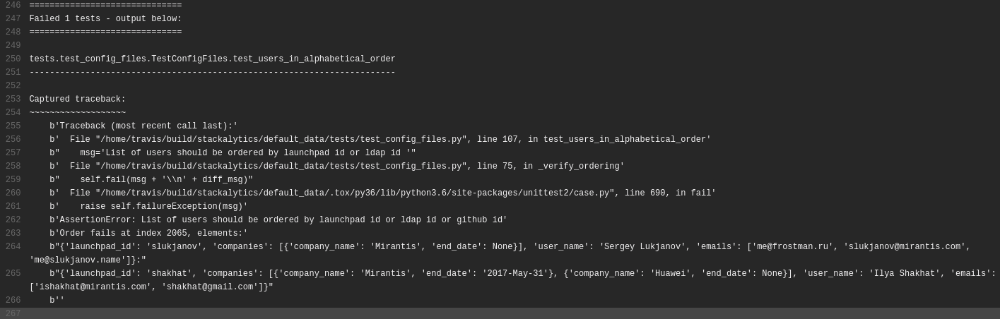

# Default data for stackalytics.com

You can find an instruction how to change your company on Stackalytics here:
https://wiki.openstack.org/wiki/Stackalytics#Company_affiliation

## How to run tests locally 

There is a set of Python tests which validate default_data.json
To run these test you can use next commands:

    pip install tox
    tox -e py36

## Failed tests in Github Pull Requests

If `default_data.json` became invalid after you corrections you will see
red Travis CI jobs in Github pull request:

There are two ways to understand what went wrong:
1. Run tests locally as described above
2. Go to Travis CI and check console output

## How to check errors in Travis CI

To do it you need to click on `Details` link in front failed job.
There you will see following description:

Here you need to click on `The build` link to get access to console log
and see messages about failed tests:

